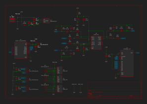

# 基板仕様

## 回路図

## 部品表

| #    | Reference                     | Value              | Qty  | Desc             | URL                                                        |
| :--- | :---------------------------- | :----------------- | :--- | :--------------- | :--------------------------------------------------------- |
| 1    | RV1                           | 5kΩ                | 1    | 半固定抵抗       | [GF063P](https://akizukidenshi.com/catalog/g/g114904/)     |
| 2    | R6,R9,R10                     | 200Ω               | 3    | カーボン抵抗     | [1/4W200](https://akizukidenshi.com/catalog/g/g125201/)    |
| 3    | R3,R4,R5,R7,R8,R11,R12        | 10kΩ               | 7    | カーボン抵抗     | [1/4W10k](https://akizukidenshi.com/catalog/g/g125103/)    |
| 4    | R1,R2,R13                     | 33kΩ               | 3    | カーボン抵抗     | [1/4W33k](https://akizukidenshi.com/catalog/g/g125333/)    |
| 6    | J5                            | Conn_01x02_Pin     | 1    | ピンヘッダ       | [PH-1x40SG](https://akizukidenshi.com/catalog/g/g100167/)  |
| 7    | J2,J3,J4                      | Conn_01x05_Socket  | 3    | ピンソケット     | [FHU-1x42SG](https://akizukidenshi.com/catalog/g/g105779/) |
| 8    | J1                            | MJ-180P            | 1    | DCジャック       | [MJ-180P](https://akizukidenshi.com/catalog/g/g106514/)    |
| 9    | D1                            | 1N4007             | 1    | ダイオード       | [1N4007](https://akizukidenshi.com/catalog/g/g100934/)     |
| 10   | C10,C11,C15                   | 1μF                | 3    | コンデンサ       | [0.1uF50v](https://akizukidenshi.com/catalog/g/g100090/)   |
| 11   | C8,C9,C16                     | 0.47μF             | 3    | コンデンサ       | [0.47uF50v](https://akizukidenshi.com/catalog/g/g115938/)  |
| 12   | C4                            | 47μF               | 1    | 電源用コンデンサ | [47uF63v](https://akizukidenshi.com/catalog/g/g117403/)    |
| 13   | C1,C2,C3,C5,C6,C7,C12,C13,C14 | 0.1μF              | 9    | コンデンサ       | [0.1uF50v](https://akizukidenshi.com/catalog/g/g100090/)   |
| 14   | U2                            | BA033CC0T          | 1    | レギュレータ     | [BA033CC0T](https://akizukidenshi.com/catalog/g/g113675/)  |
| 15   | U7                            | MCP3208-CI_P       | 1    | ADC              | [MCP3208](https://akizukidenshi.com/catalog/g/g100238/)    |
| 16   | U6                            | NJM2747D           | 1    | オペアンプ       | [NJM2747D](https://akizukidenshi.com/catalog/g/g109117/)   |
| 17   | U3,U4,U5                      | MERB-09            | 3    | 筋電センサ       |                                                            |
| 18   | U1                            | ESP32-C3_SUPERMINI | 1    | マイコン         |                                                            |

- オプション

| #    | Reference | Value          | Qty  | Desc                 | URL                                                        |
| :--- | :-------- | :------------- | :--- | :------------------- | :--------------------------------------------------------- |
| 1    | J6        | Conn_01x02_Pin | 1    | ジャンパピン         | [MJ-254-6BK](https://akizukidenshi.com/catalog/g/g103687/) |
| 2    | U6        | Conn_01x02_Pin | 1    | ICソケット           | [2227-16](https://akizukidenshi.com/catalog/g/g100007/)    |
| 3    | -         | M3x6           | 4    | 基板取り付けネジ     | [M3x6](https://akizukidenshi.com/catalog/g/g110245/)       |
| 4    | -         | M3x0.5         | 4    | 基板取り付けナット   | [M3x0.5](https://akizukidenshi.com/catalog/g/g111521/)     |
| 5    | -         | M3-10-4        | 4    | 基板取り付けスペーサ | [M3-10-4](https://akizukidenshi.com/catalog/g/g108164/)    |
| 6    | -         | -              | 4    | ゴム足               | [020-001](https://akizukidenshi.com/catalog/g/g116317/)    |
